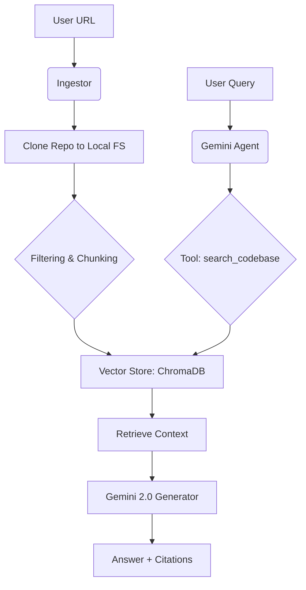

# Codebase Q&A Assistant (BMAD V6 Edition)

An intelligent, agentic RAG system that allows you to chat with any GitHub repository using **Gemini 2.0** and **LangChain**.

---

## 🚀 How it Works (System Flow)



1.  **Ingestion:** You provide a GitHub URL. The system clones it locally.
2.  **Indexing:** The code is filtered (no binaries or `.git` files) and split into meaningful "chunks" using a code-aware text splitter.
3.  **Embedding:** **FastEmbed** generates semantic vectors locally.
4.  **Storage:** Vectors are stored in **ChromaDB**.
5.  **Agentic Q&A:** The **Gemini 2.0 Agent** takes your question, uses its `search_codebase` tool to find context, and then generates an answer citing the source files.

---

## 🛠️ Tech Stack

- **Brain (LLM):** Google Gemini 2.0 (Flash & Pro)
- **Framework:** LangChain
- **Embeddings:** Local BGE-Small (via FastEmbed)
- **Database:** ChromaDB (Local)
- **Languages Support:** Python, JavaScript, TypeScript, Java (and more via Recursive Splitters)

For a detailed breakdown of these technologies, see [**TECH_STACK.md**](./TECH_STACK.md).

---

## 📦 Installation

1.  **Clone this repository**:
    ```bash
    git clone https://github.com/PrinceJoshi312/Codebase-Q-A-Assistant
    cd codebase-qa-assistant
    ```

2.  **Install dependencies**:
    ```bash
    pip install -r requirements.txt
    ```

3.  **Set up environment variables**:
    - Copy `.env.example` to `.env`.
    - Add your `GOOGLE_API_KEY` from [Google AI Studio](https://aistudio.google.com/app/apikey).

---

## 💻 Usage

Run the main application:
```bash
python src/main.py
```

1.  Enter the URL of the GitHub repository you want to analyze.
2.  Wait for the indexing to complete.
3.  Start chatting with your codebase!

---

## 📂 Project Structure

- `src/`: Core source code.
  - `ingestion/`: Repository cloning and filtering.
  - `indexing/`: Semantic vector store management.
  - `agent/`: Gemini agent logic and RAG tools.
- `_bmad/`: BMAD framework configuration and manifests.
- `_bmad-output/`: Strategic project artifacts (PRDs, Architecture, Reports).
- `TECH_STACK.md`: Educational guide on the project's technology.

---

## ✨ Features

- **Private Repo Support:** Securely ingest repositories via SSH or Personal Access Tokens (PATs).
- **No Hallucination Mandate:** The agent is instructed to only answer based on the provided code context.
- **Local-First Indexing:** Your embeddings are generated locally, reducing costs and keeping your data private.
- **Agentic Workflow:** The AI can autonomously decide how to search the code to find the best answer.
