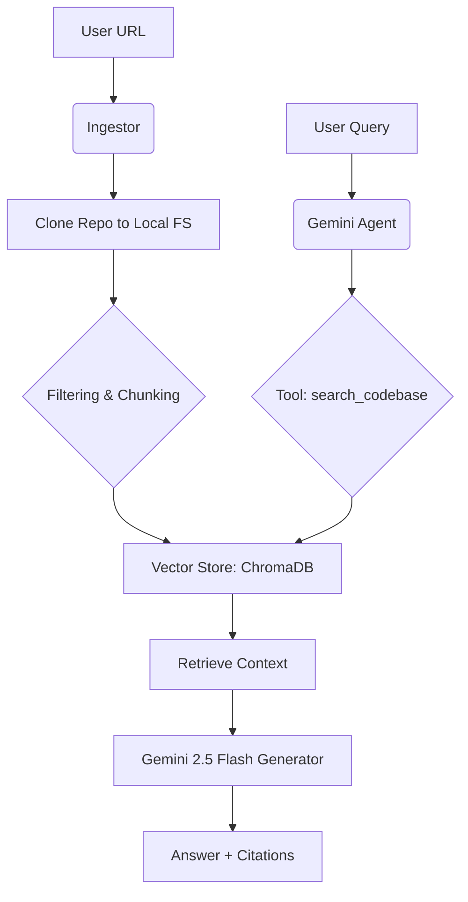

# Codebase Q&A Assistant (BMAD V6 Edition)

An intelligent, agentic RAG system that allows you to chat with any GitHub repository using **Google Gemini** and **LangChain**.

---

## 🚀 How it Works (System Flow)



1.  **Ingestion:** You provide a GitHub URL. The system clones it locally.
2.  **Indexing:** The code is filtered (no binaries or `.git` files) and split into meaningful "chunks" using a code-aware text splitter.
3.  **Embedding:** **FastEmbed** generates semantic vectors locally.
4.  **Storage:** Vectors are stored in **ChromaDB**.
5.  **Agentic Q&A:** The **Gemini Agent** takes your question, uses its `search_codebase` tool to find context, and then generates an answer citing the source files.

### 🚢 Deployment

#### One-Click Deployment (Recommended)
You can deploy this application easily using the provided `Dockerfile` or a platform like **Render** or **Railway**.

1. **Environment Variables:**
   - `GOOGLE_API_KEY`: Your Gemini API key.
   - `GEMINI_MODEL`: Defaults to `gemini-2.5-flash`.
   - `PORT`: (Optional) Defaults to `8000`.

2. **Docker:**
   ```bash
   docker build -t codebase-qa .
   docker run -p 8000:8000 --env-file .env codebase-qa
   ```

3. **Manual Production Build:**
   If you want to run it manually in production:
   ```bash
   # 1. Build frontend
   cd frontend
   npm install
   npm run build
   cd ..

   # 2. Run backend (it will serve the built frontend)
   pip install -r requirements.txt
   uvicorn src.api:app --host 0.0.0.0 --port 8000
   ```

---

## 🛠️ Tech Stack

- **Brain (LLM):** Google Gemini 2.5 Flash
- **Framework:** LangChain
- **Embeddings:** Local BGE-Small (via FastEmbed)
- **Database:** ChromaDB (Local)
- **Frontend:** React + Vite + Tailwind CSS
- **Backend:** FastAPI + Uvicorn

For a detailed breakdown of these technologies, see [**TECH_STACK.md**](./TECH_STACK.md).

---

## 📦 Installation

1.  **Clone this repository**:
    ```bash
    git clone https://github.com/PrinceJoshi312/Codebase-Q-A-Assistant
    cd Codebase-Q-A-Assistant
    ```

2.  **Install dependencies**:
    ```bash
    pip install -r requirements.txt
    cd frontend
    npm install
    cd ..
    ```

3.  **Set up environment variables**:
    - Copy `.env.example` to `.env`.
    - Add your `GOOGLE_API_KEY` from [Google AI Studio](https://aistudio.google.com/app/apikey).

---

## 💻 Usage

### Running Both Frontend & Backend (Recommended)
The easiest way to start the entire system is to use the `run_all.py` script:

```bash
python run_all.py
```

This script will:
- Forcefully clear port 8000 and 3000 if they are occupied.
- Launch the **Code Intelligence Backend** (Port 8000).
- Launch the **Neural Interface Frontend** (Port 3000).
- Automatically open your default web browser to the application.

### Running Separately

**Backend:**
```bash
python start_backend.py
```

**Frontend:**
```bash
cd frontend
npm run dev
```

1.  Enter the URL of the GitHub repository you want to analyze.
2.  Wait for the indexing to complete.
3.  Start chatting with your codebase!

---

## 📂 Project Structure

- `src/`: Core source code.
  - `ingestion/`: Repository cloning and filtering.
  - `indexing/`: Semantic vector store management.
  - `agent/`: Gemini agent logic and RAG tools.
- `frontend/`: React frontend application.
- `_bmad/`: BMAD framework configuration and manifests.
- `_bmad-output/`: Strategic project artifacts (PRDs, Architecture, Reports).
- `TECH_STACK.md`: Educational guide on the project's technology.

---

## ✨ Features

- **Private Repo Support:** Securely ingest repositories via SSH or Personal Access Tokens (PATs).
- **No Hallucination Mandate:** The agent is instructed to only answer based on the provided code context.
- **Local-First Indexing:** Your embeddings are generated locally, reducing costs and keeping your data private.
- **Agentic Workflow:** The AI can autonomously decide how to search the code to find the best answer.
- **Execution Flow Visualization:** Ask "How does this code run?" to see a step-by-step logic flow.
